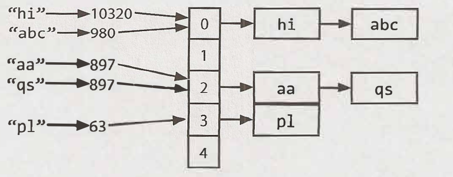

# Summary

Chapter1. Array and Strings

## Hash Tables

Steps to inset new key and value to a hash table:
1. First, compute the key's hash code (usually int or long). Note that two different keys could have the same hash code.
2. Then, map the hash code to an index in the array (Ex. hash(key) % array_length). Two different hash codes could map to the same index.
3. At this index, there is a linked list of keys and values. Store the key and value in this index. We must use a linked list because of collisions: you could have two different keys with the same hash code, or two different hash codes that map to the same index.  

We generally assume a good implementation that keeps collisions to a minimum, in which case the lookup time is 0(1).
  

## Array List & Resizeable Arrays

In many languages lists are resizeable. However, in some languages such as Java, a list has a fixed length. In such situations, when we want to use array-like data structure that need dynamic resizing, ArrayList is used. An Arraylist is an array that resizes itself as needed while still providing 0(1) access. A typical implementa­tion is that when the array is full, the array doubles in size. Each doubling takes 0(n) time, but happens so rarely that its amortized insertion time is still O(1).
  

## StringBuilder

`sentence = ''` 
`for w in words: sentence += w` 
 -> O(n^2)

Rather than the previous code, StringBuilder simply creates a resizable list.
`sentence = ''` 
`for w in words: sentence.append(w)` 
-> O(n)